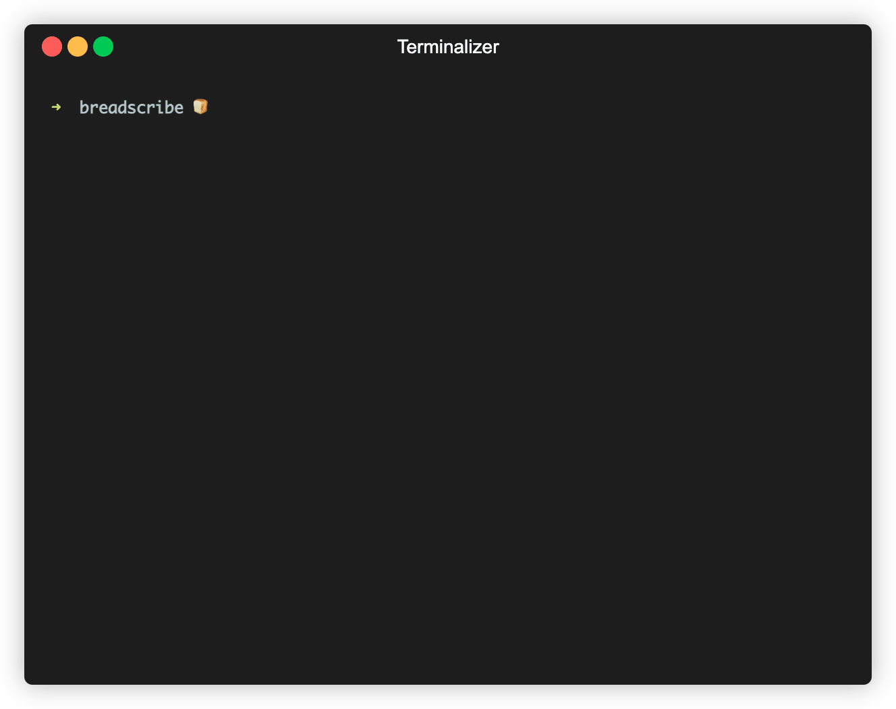

# BreadScribe


[](https://github.com/hendricius/breadscribe/actions/workflows/ci.yml)

Breadscribe is your tool to transcribe bread related videos, especially sourdough focused clips. Pass it one or many media files, and it writes a plain text file next to each video with the same base name. You can also opt in to SRT or VTT subtitles.

Breadscribe includes a small dictionary of sourdough terms from my book [**The Sourdough Framework**](https://www.the-sourdough-framework.com/), which helps the model keep domain-specific words like starter, fermentolyse, autolyse, bulk fermentation, and proofing intact.



### Features

- Local transcription with open source models, no paid APIs
- Works on single files or folders
- Sidecar outputs next to each input: `clip.mp4` becomes `clip.txt`
- Optional `--srt` and `--vtt` subtitle files
- Cleaning pass to reduce filler phrases and collapsed word repeats
- Audio stream selection and near silence guard for b roll

### Requirements

- Python 3.10 or newer
- FFmpeg tools on PATH: `ffmpeg` and `ffprobe`
  - macOS: `brew install ffmpeg`
  - Ubuntu: `sudo apt-get update && sudo apt-get install -y ffmpeg`
  - Windows: download FFmpeg release, add the `bin` folder to PATH

### Install

Create a virtual environment if you prefer, then install the project in editable mode with test and lint tools.

```bash
python -m pip install --upgrade pip
pip install -e ".[test,lint]"
```

If you like to keep workflows simple, you can use the Makefile targets below.

### Quick start

Use the Makefile for common tasks.

```bash
# One time setup, installs dependencies
make setup

# Transcribe the bundled sample videos with safe defaults
make transcribe-sample

# Transcribe a whole folder 
make transcribe FOLDER="path/to/folder"

# Run fast tests
make test

# Run the slow sample tests locally only
make test-sample
```

### Basic CLI usage

Although the Makefile is convenient, you can call the CLI directly.

```bash
breadscribe /path/to/folder
breadscribe /path/to/clip.mp4 --srt
breadscribe /clips --model large-v3 --device cuda --compute-type float16
breadscribe /clips --language auto --clean-fillers
```

### Notes on the sourdough glossary

The tool ships with a small list of common sourdough terms. You can bias transcription further with `--initial-prompt "your, extra, terms"` when needed.

### Troubleshooting

- ffmpeg: command not found: install FFmpeg and ensure it is on PATH.
- Output is junk for b roll: try `--strict-no-speech` and `--clean-fillers`. Use `--stream-index 0` or `1` if the file has multiple audio tracks.
- Slow on CPU: use `distil-large-v3` or `tiny.en`. On NVIDIA GPUs use `--device cuda --compute-type float16`.

### Contributing

Issues and pull requests are welcome. Please run `make lint` and `make test` before you open a PR.

### License

MIT